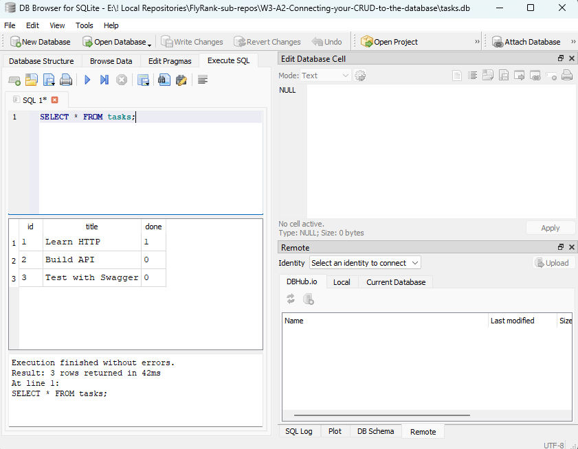

# Task Management CRUD API - SQLite Database

A FastAPI backend application demonstrating a persistent CRUD (Create, Read, Update, Delete) API. This project replaces an in-memory list with a permanent SQLite database, ensuring that all data survives server restarts.

## Why SQLite?
SQLite was chosen for this project because it is lightweight, operates as a single file, and requires zero separate server setup or configuration. Most importantly, it provides full data persistence so that tasks survive server restarts.

## Database Location & Setup
The database lives in a file named `tasks.db`. 
* It is **created automatically** the first time the application runs—no manual setup is required.
* The application is configured to automatically seed three example tasks only if the table is empty.
* The `tasks.db` file is included in `.gitignore` so that anyone cloning this repository starts with a completely fresh, clean database.

## How to Run the Project
To start the FastAPI server, clone the repository, ensure your environment is set up, and run these commands in your terminal:

1. Install the required dependencies:
   ```bash
   pip install fastapi uvicorn
2. Start the local server:
    ```bash
    uvicorn main:app --

## Example SQL Query
During testing, I interacted with the database directly using DB Browser. Here is an example query I ran:
    ```bash
        SELECT * FROM tasks;
    ```
This query successfully returned all rows in the tasks table.

## DB Browser SQLite UI


## Reflecting on Schema Changes
Changing the table's shape after the database was already populated felt disruptive, as I had to completely delete my existing tasks.db file and lose my data just to add the new timestamp columns. Experiencing this friction firsthand made it immediately clear why professional database migrations exist to safely evolve a schema without destroying the underlying data.